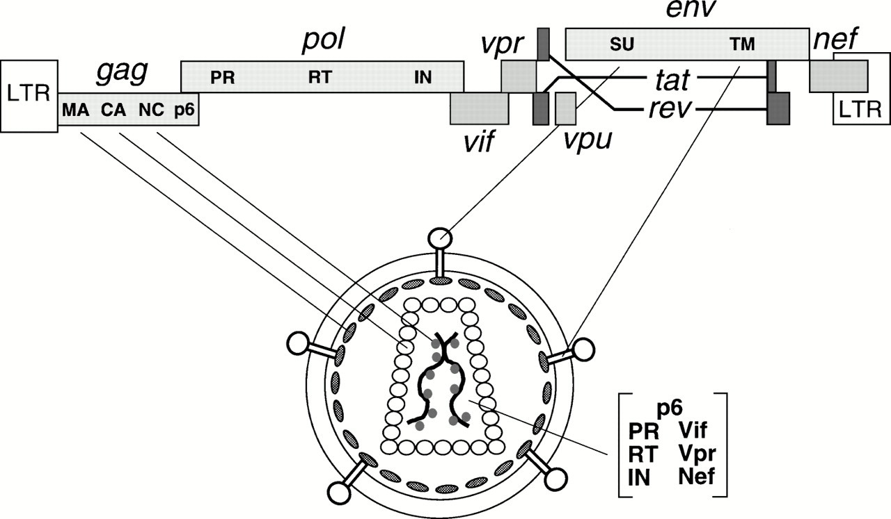

# hiv_wide
pol vs whole analyses

## Goals

- [x] Make a single alignment of all full genomes to be considered. Obtain the start and stop positions of pol. ([#3](/../../issues/3), `LANL_alignment.tar.xz`)
- [ ] Randomize the order of the rows.
- [ ] Apply masks to all but pol for 0%, 10%, 20%, ... 100% of the rows, starting with the bottom row. This means that for example, the sequences masked in the 10% sample are a perfect subsample of those masked in the 20% sample. The resulting matrices would have a T shape, where the bar across the top is the sequences that are fully sampled and the vertical stem is the pol samples, with all other sites before and after masked (replaced with gaps).
- [ ] Do ML search and bootstraps for each of the 11 subsamples (including 0% masking)
- [ ] For each bipartition in the 0% masking tree, identify bootstrap support in each of the samples. Look for decay in support as progressively more sequences are masked. This gives a sense of false negatives, ie loss of signal, as we go from full genome to just pol.
- [ ] Identify any strongly supported ML bipartitions in highly masked analyses that have low support in the unmasked matrix. This gives an example of false positives, ie relationships that have increased support as data are removed. These are cases where pol is potentially misleading.
- [ ] Possibly randomize and repeat again, to assess sensitivity to order.

## Data

Data are available in this [google drive folder](https://drive.google.com/drive/folders/1_v5C3hmwxQvOkPTAerSUu7ski1K_hLu1). After download, move the `clean` and `raw` directories to `public-hiv-data-20201202/`.

## Background

### Genome

> The HIV-1 genome encodes nine open reading frames. Three of these encode the Gag, Pol, and Env polyproteins, which are subsequently proteolyzed into individual proteins common to all retroviruses. The four Gag proteins, MA (matrix), CA (capsid), NC (nucleocapsid), and p6, and the two Env proteins, SU (surface or gp120) and TM (transmembrane or gp41), are structural components that make up the core of the virion and outer membrane envelope. The three Pol proteins, PR (protease), RT (reverse transcriptase), and IN (integrase), provide essential enzymatic functions and are also encapsulated within the particle. HIV-1 encodes six additional proteins, often called accessory proteins, three of which (Vif, Vpr, and Nef) are found in the viral particle. Two other accessory proteins, Tat and Rev, provide essential gene regulatory functions, and the last protein, Vpu, indirectly assists in assembly of the virion. The retroviral genome is encoded by an ∼9-kb RNA, and two genomic-length RNA molecules are also packaged in the particle. Thus, in simplistic terms, HIV-1 may be considered as a molecular entity consisting of 15 proteins and one RNA. [https://www.annualreviews.org/doi/10.1146/annurev.biochem.67.1.1](https://www.annualreviews.org/doi/10.1146/annurev.biochem.67.1.1)
